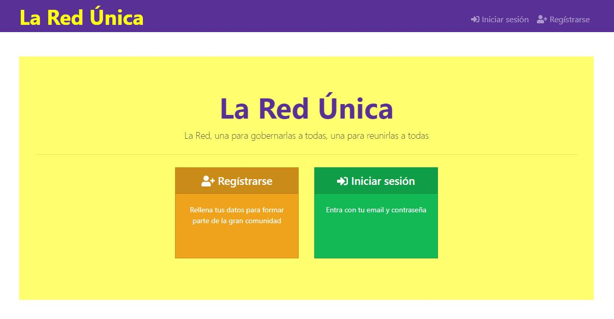
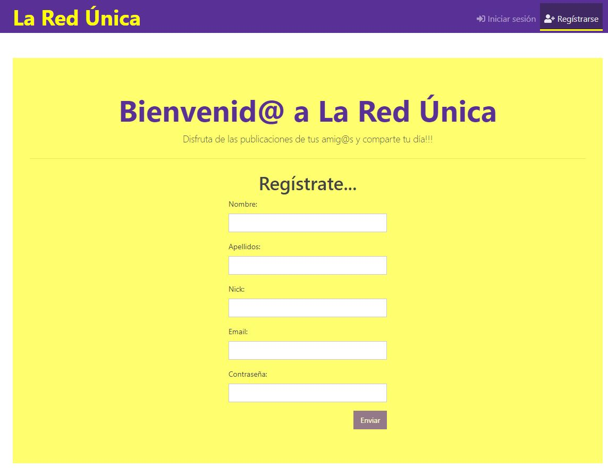
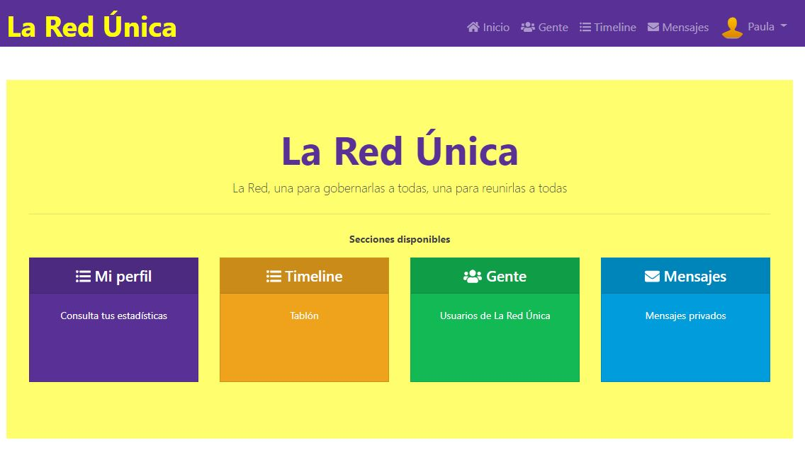
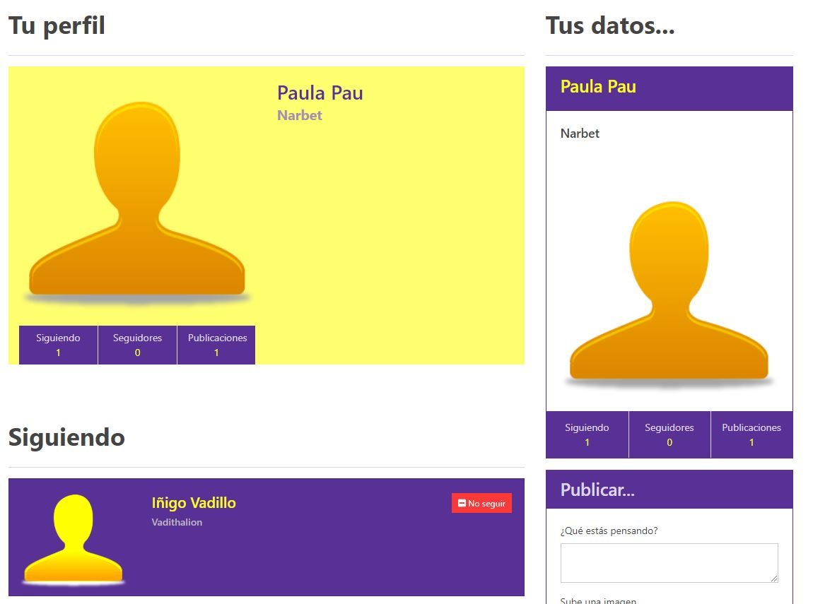
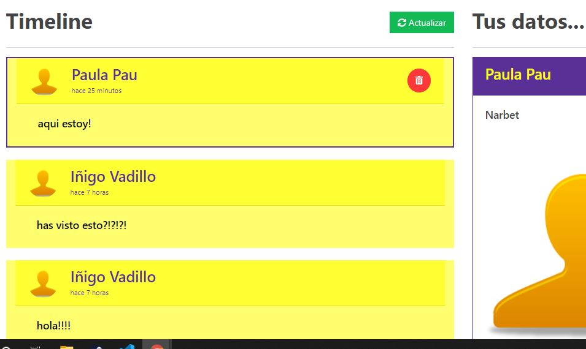
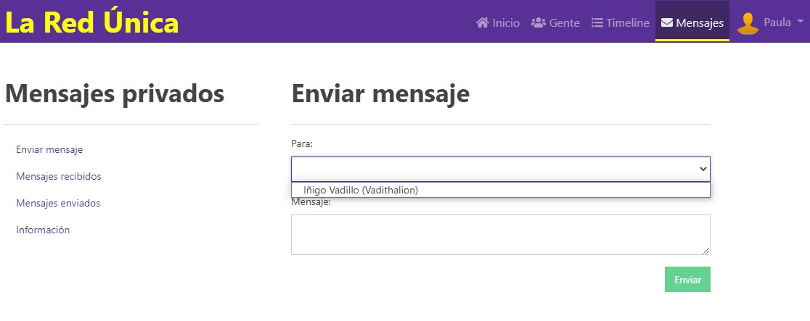
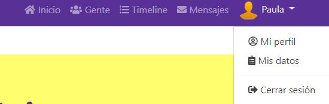
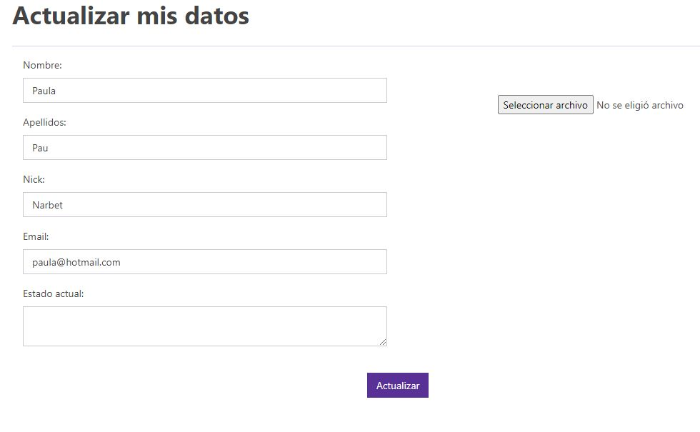

# socialFront 🚀

---
## Frontend con tecnología angular

Bienvenidos a la Red Única, red social con opciones de seguimiento de usuarios, publicaciones, mensajeria privada y estadisticas.

Aplicacion de frontend, adaptable a diversas tecnologias de backend + base de datos

## Tecnologías usadas e instalación 🛠️

* [angular](https://angular.io/docs) <--- Link a la documentación

> npm i

ejecuta este comando tras la descarga o clonación para que el proyecto funcione en tu máquina
[ejemplo de estilo](https://github.com/javimontoto/MiREDE)

---
* Pantalla de inicio sin usuario registrado

* Para empezar, registra el usuario:

* Una vez logueados (y autenticados mediante el token en el local storage) nuestra vista principal pasa a ser la siguiente:

* Tendremos a nuestra disposición todas las opciones de La Red.

* Acceso a nuestro perfil y nuestras estadisticas:

* Vista de las publicaciones de los perfiles seguidos por el usuario:

* Listado de gente en La Red

* Mensajeria privada entre seguidores

* Desde la barra de navegacion, tendremos los mismos links, y un desplegable en nuestro nombre con las opciones:

* con la opcion de ir a nuestro perfil, e incluso editar los datos del usuario logueado

---
## **Autor** ✒️

[Iñigo Vadillo](https://www.linkedin.com/in/i%C3%B1igovadilloruiz/) <--Linkedin